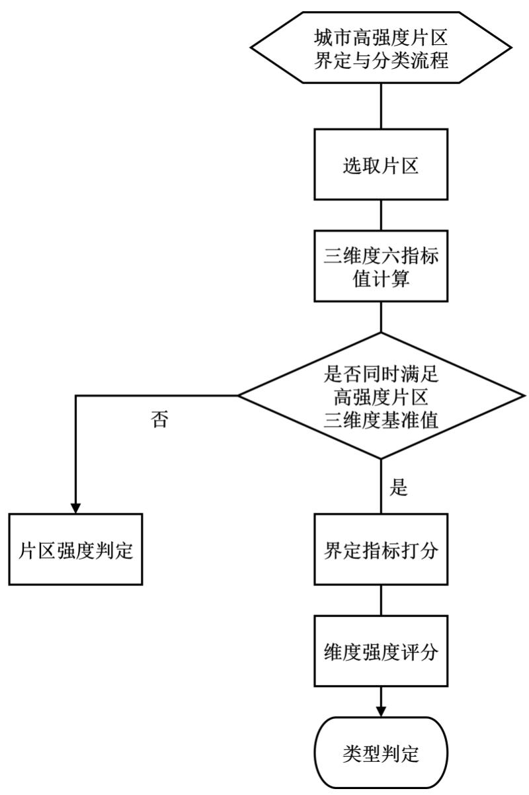

<!-- PAGE 1 -->
# 中国工程建设标准化协会标准

<!-- PAGE 2 -->
# 城市高强度片区界定与分类标准

Standard for definition and classification of urban high-intensity districts （征求意见稿）

中国工程建设标准化协会

# 城市高强度片区界定与分类标准

Standard for definition and classification of urban high-intensity districts

T/CECS \*\*\* -202X

主编单位：深圳大学

批准单位：中国工程建设标准化协会

施行日期：202X年X月X日

# 前 言

根据中国工程建设标准化协会《关于印发 $< 2 0 2 4$ 年第一批协会标准制订、修订计划 $| >$ 的通知》（建标协字（2024）15号）的要求，编制组经深入调查研究，认真总结实践经验，并在广泛征求意见的基础上，制定本标准。

本标准共分5章，主要技术内容包括：总则、术语、城市高强度片区界定与分类流程、城市高强度片区的界定、城市高强度片区的分类。

本标准的某些内容可能直接或间接涉及专利，本标准的发布机构不承担识别这些专利的责任。

本标准由中国工程建设标准化协会建筑产业化分会归口管理，由深圳大学负责具体技术内容的解释。实施过程中如有意见或建议，请寄送至深圳大学（地址：广东省深圳市南山区南海大道3688号，邮编：518060）。

主编单位：深圳大学参编单位：东南大学

东南大学城市规划设计研究院有限公司  
深圳市建筑设计研究总院有限公司  
北京建筑大学  
上海理工大学

主要起草人：李晓宇 陈海林 金俊史北祥 李舒扬梁红伟 林思铭 王航　梅 玥　杨子迪卢　君　张颖异　郭谌达　陈鹏宇　杨旭

# 目 次

1总则.  
2术语..  
3城市高强度片区的界定  
4城市高强度片区的分类  
用词说明.... 12引用标准名录 13

<!-- PAGE 6 -->
# Contents

1 General provisions...   
2 Terms ..... .2   
3 Definition of urban high-intensity district.. .4   
4Classification of urban high-intensity district... ..9   
List of quoted standar... .12   
Addition: Explanation of provisions... .13

# 1总 则

1.0.1为统一城市高强度片区界定与分类，依据《城市用地分类与规划建设用地标准》，科学地编制、审批、实施城市高强度片区设计，规范城市高强度片区的界定、分类、建设和管理，提高城市环境存量优化与开发建设水平，促进城市高强度片区的可持续发展，制定本标准。

1.0.2本标准适用于城市高强度片区的设计、建设、管理和研究等工作。

1.0.3城市高强度片区的界定与分类除应符合本标准规定外，尚应符合国家现行有关标准的规定。

# 2术 语

2.0.1城市高强度片区 urban high-intensity district

通常位于城市功能与结构的核心或城市空间的战略性增长极，是以公共交通为支撑的城市地上地下空间高强度开发建设和公共性服务功能的高强度集聚区。

2.0.1地上容积率 overground floor area ratio一个地块的地上建筑总面积与净用地面积的比率。

2.0.2地下容积率 underground floor area ratio一个地块的地下建筑总面积与净用地面积的比率。

2.0.3综合容积率 composite floor area ratio一个地块的地上及地下建筑总面积与净用地面积的比率。

2.0.4市内轨交站等效密度 density of rail transit stations

一定范围内，城市内轨道交通站点数量与净用地面积的比值，单位为个/平方公里（个 $/ \mathrm { k m } ^ { 2 }$ ）。

# 2.0.5公共交通站点等效密度 density of bus stops

一定范围内，城市内地面以上公交站点数量与净用地面积的比值，单位为个/平方公里（个 $/ \mathrm { k m } ^ { 2 }$ ）。

2.0.6交通站点等效密度 density of transportation stops

一定范围内，城市内轨道交通站点数量及地面以上公交站点数量与净用地面积的比值，单位为个/平方公里（个 $/ \mathrm { k m } ^ { 2 }$ ）。

2.0.7公共管理与公共服务用地占比 administration and public services use ratio

一定范围内，行政、文化、教育、体育、卫生等机构和设施的用地（不包括居住用地中的服务设施用地）在总用地中所占的比例。

2.0.8商业服务用地占比 commercial and business facilities use ratio

一定范围内，各类商业、商务、娱乐康体等设施用地（不包括居住用地中的服务设施用地以及公共管理与公共服务用地内的事业单位用地)在总用地中所占的比例。

2.0.9公共性用地占比 public land ratio

一定范围内，包含商业服务用地及公共管理与公共服务用地在总用地中所占的比例。

# 3城市高强度片区的界定

# 3.1城市高强度片区界定与分类流程

3.1.1城市高强度片区的界定与分类流程包含了片区选取、维度及指标计算、基准值判定、强度判定、界定指标打分、维度强度评分、类型判定等步骤。

3.1.2 城市高强度片区的界定与分类流程应按照下图3.1.2的步骤：

  
图3.1.2城市高强度片区的界定与分类流程图

# 3.2城市高强度片区的界定维度

3.2.1 城市高强度片区，通常位于城市功能与结构的核心或城市空间的战略性增长极，是以公共交通为支撑的城市地上地下空间高强度开发建设和城市主要公共服务功能的集聚区。

3.2.2 城市高强度片区适用尺度范围宜控制在 $0 . 5 { \sim } 2 . 0$ 平方公里。

3.2.3城市高强度片区的界定维度，应包括建设、功能、交通共计三个界定维度，各界定维度基准值见表3.2.3。

表3.2.3城市高强度片区界定维度基准值  

<table><tr><td rowspan=1 colspan=3>界定基准值</td></tr><tr><td rowspan=1 colspan=1>建设</td><td rowspan=1 colspan=1>交通</td><td rowspan=1 colspan=1>功能</td></tr><tr><td rowspan=1 colspan=1>综合容积率为3.8</td><td rowspan=1 colspan=1>交通站点等效密度为9.9（个/km²）</td><td rowspan=1 colspan=1>公共性用地占比为54.0%</td></tr></table>

说明：城市高强度片区聚焦中微观尺度，关注空间的立体化及复合化特征，强调从建设、交通、功能三个维度对片区强度进行维度界定，分别对应综合容积率、交通站点等效密度、公共性用地占比三个界定维度基准值。

$\textcircled{1}$ 各界定维度数值的计算单位需与基准值一致。

$\textcircled{2}$ 各界定维度基准值可视城市与片区级别高低适当上浮或下调 $10 \%$ 。

3.2.4城市片区的强度类型应按照表3.2.4 的界定基准值分为非高强度片区、准高强度片区、高强度片区三种类型。

表3.2.4城市片区的强度类型  

<table><tr><td rowspan=1 colspan=1>界定类型</td><td rowspan=1 colspan=1>内容</td></tr><tr><td rowspan=1 colspan=1>城市非高强度片区</td><td rowspan=1 colspan=1>综合容积率计算值小于表3.2.3的界定基准值。</td></tr><tr><td rowspan=1 colspan=1>城市准高强度片区</td><td rowspan=1 colspan=1>综合容积率计算值大于等于表3.2.3的界定基准值，且交通和功能维度计算值不同时大于等于表3.2.3的界定基准值。</td></tr><tr><td rowspan=1 colspan=1>城市高强度片区</td><td rowspan=1 colspan=1>三个维度计算值均大于等于表3.2.3 的界定基准值。</td></tr></table>

说明：城市片区的强度界定，首要依据为综合容积率，当综合容积率低于其界定基准值时，则界定为城市非高强度片区；当综合容积率大于等于其界定基准值时，则应进一步计算交通站点等效密度和公共性用地占地，此时，若二者计算值不同时大于等于其界定基准值，则界定为城市准高强度片区；当综合容积率、交通站点等效密度、公共性用地占地均大于等于其界定基准值时，则界定为城市高强度片区。

3.2.5 城市高强度片区界定指标，包括地上容积率、地下容积率、市内轨交站等效密度、公共交通站点等效密度、公共管理与公共服务用地占比、商业服务用地占比共计六项。

3.2.6城市高强度片区界定维度与界定指标的计算关系应符合表3.2.6的规定：

表3.2.6城市高强度片区界定指标分类与说明  

<table><tr><td rowspan=1 colspan=1>界定维度</td><td rowspan=1 colspan=2>界定指标</td><td rowspan=1 colspan=1>维度合计</td></tr><tr><td rowspan=2 colspan=1>建设</td><td rowspan=2 colspan=1>综合容积率</td><td rowspan=1 colspan=1>地上容积率</td><td rowspan=2 colspan=1></td></tr><tr><td rowspan=1 colspan=1>地下容积率</td></tr><tr><td rowspan=2 colspan=1>交通</td><td rowspan=2 colspan=1>交通站点等效密度</td><td rowspan=1 colspan=1>市内轨交站等效密度</td><td rowspan=2 colspan=1></td></tr><tr><td rowspan=1 colspan=1>公共交通站点等效密度</td></tr><tr><td rowspan=2 colspan=1>功能</td><td rowspan=2 colspan=1>公共性用地占比</td><td rowspan=1 colspan=1>公共管理与公共服务用地占比</td><td rowspan=2 colspan=1></td></tr><tr><td rowspan=1 colspan=1>商业服务用地占比</td></tr></table>

# 3.3地上容积率

3.3.1地上容积率，是指片区范围内，地上建筑面积的总和与该片区净用地面积的比率。片区净用地面积不包含道路及绿地面积。

3.3.2地上容积率，应按下式计算：

$$
\begin{array} { r } { D _ { O } = \frac { S _ { o } } { S _ { a } } } \end{array}
$$

式中： $D _ { O }$ ——地上容积率$S _ { o }$ —地上建筑总面积（ $\mathrm { k m } ^ { 2 }$ ）$S _ { a }$ -—片区净用地面积（ $\mathrm { k m } ^ { 2 }$ ），不包含道路及绿地面积

# 3.4地下容积率

3.4.1地下容积率，是指片区范围内，地下建筑面积的总和与该片区净用地面积的比率。片区净用地面积不包含道路及绿地面积。

3.4.2地下容积率，应按下式计算：

$$
\begin{array} { r } { D _ { U } = \frac { S _ { u } } { S _ { a } } } \end{array}
$$

式中： $D _ { U }$ ——地下容积率

$S _ { u }$ —地下建筑总面积（ $\mathrm { k m } ^ { 2 }$ ）$S _ { a }$ -—片区净用地面积（ $\mathrm { k m } ^ { 2 }$ ），不包含道路及绿地面积

# 3.5市内轨交站等效密度

3.5.1市内轨交站等效密度，是指片区范围内，城市内轨道交通站点数量与该片区净用地面积的比值。城市内轨道交通站点包括地铁站点与有轨电车站点。片

区净用地面积不包含道路及绿地面积。

3.5.2市内轨交站等效密度，应按下式计算：

$$
\begin{array} { r } { D _ { R T S } = \frac { ( N _ { s u b } \times 3 + N _ { t r a } ) } { S _ { a } } } \end{array}
$$

式中： $D _ { R T S }$ -市内轨交站等效密度$N _ { s u b }$ 地铁站点数量（个）$N _ { t r a }$ -有轨电车站点数量（个 $/ \mathrm { k m } ^ { 2 }$ ）$S _ { a }$ —片区净用地面积（ $\mathrm { k m } ^ { 2 }$ ），不包含道路及绿地面积

# 3.6公共交通站点等效密度

3.6.1公共交通站点等效密度，是指片区范围内，城市内地面以上公交站点数量与该片区净用地面积的比值。城市内地面以上公交站点包括快速公交站点与公交站点。片区净用地面积不包含道路及绿地面积。

3.6.2公共交通站点等效密度，应按下式计算：

$$
\begin{array} { r } { D _ { B S } = \frac { \left( N _ { k b } + N _ { b } \times 0 . 3 \right) } { S _ { a } } } \end{array}
$$

式中： $D _ { B S }$ -公共交通站点等效密度$N _ { k b }$ 快速公交站点数量（个）$N _ { b }$ —公交站点数量（个） $/ \mathrm { k m } ^ { 2 }$ ）$S _ { a }$ —片区净用地面积（ $\mathrm { k m } ^ { 2 }$ ），不包含道路及绿地面积

# 3.7公共管理与公共服务用地占比

3.7.1公共管理与公共服务用地占比，是指片区范围内，行政、文化、教育、体育、卫生等机构和设施的用地（不包括居住用地中的服务设施用地）与总用地面积的比值。总用地面积不包含道路。

3.7.2公共管理与公共服务用地占比，应按下式计算：

$$
P _ { A P } = \frac { S _ { a p } } { S _ { b } } \times 1 0 0 \%
$$

式中： $P _ { A P }$ -公共管理与公共服务用地占比$S _ { a p }$ -行政、文化、教育、体育、卫生等机构和设施用地面积（ $\cdot \mathrm { k m } ^ { 2 }$ ），

不包括居住用地中的服务设施用地

$S _ { b }$ ——片区总用地面积（ $\mathrm { k m } ^ { 2 }$ ），不包含道路面积

# 3.8商业服务用地占比

3.8.1商业服务用地占比，是指片区范围内，各类商业、商务、娱乐康体等设施用地（不包括居住用地中的服务设施用地以及公共管理与公共服务用地内的事业单位用地）与总用地面积的比值。总用地面积不包含道路。

3.8.2商业服务用地占比，应按下式计算：

$$
\begin{array} { r } { P _ { C B } = \frac { S _ { c b } } { S _ { b } } \times 1 0 0 \% } \end{array}
$$

式中： $P _ { C B }$ 商业服务用地占比

$S _ { c b }$ —商业、商务、娱乐康体等设施用地面积（ $\mathrm { k m } ^ { 2 }$ ），不包括居住用地中的服务设施用地以及公共管理与公共服务用地内的事业单位用地

$S _ { b }$ ——片区总用地面积（ $\mathrm { k m } ^ { 2 }$ ），不包含道路面积

# 4城市高强度片区的分类

4.0.1对城市片区强度判定时，应根据本标准3.3至3.8节所规定的六项指标值，参照表3.2.6计算各界定维度值，并参照表3.2.4得出城市片区的强度类型判定结果。

4.0.2城市高强度片区分类时应采用大类、小类两个层次。

4.0.3城市高强度片区的分类详情应符合表4.0.3城市高强度片区分类基本规定。

表4.0.3城市高强度片区分类基本规定  

<table><tr><td rowspan=1 colspan=1>序号</td><td rowspan=1 colspan=2>城市高强度片区类型</td><td rowspan=1 colspan=1>内容</td><td rowspan=1 colspan=1>维度强度等级评分对照</td></tr><tr><td rowspan=1 colspan=1>1</td><td rowspan=3 colspan=1>单维主导型</td><td rowspan=1 colspan=1>建设主导型</td><td rowspan=1 colspan=1>常见于大型企业产业园，具有高建筑容积率。</td><td rowspan=1 colspan=1>建设强度等级为高，交通、功能等级为中或低。</td></tr><tr><td rowspan=1 colspan=1>2</td><td rowspan=1 colspan=1>交通主导型</td><td rowspan=1 colspan=1>常见于城际轨交站、城市轨道交通换乘枢纽及公交站点密集区域，具有完善的以公共交通运输功能为主的地区。</td><td rowspan=1 colspan=1>交通强度等级为高，建设、功能等级为中或低。</td></tr><tr><td rowspan=1 colspan=1>3</td><td rowspan=1 colspan=1>功能主导型</td><td rowspan=1 colspan=1>常见于老旧商场和步行街地区，地上人行道路发达，但地下交通功能缺失或不足。</td><td rowspan=1 colspan=1>功能强度等级为高，建设、交通等级为中或低。</td></tr><tr><td rowspan=1 colspan=1>4</td><td rowspan=3 colspan=1>多维主导型</td><td rowspan=1 colspan=1>建设与交通主导型</td><td rowspan=1 colspan=1>常见于拥有地铁线路换乘站的高建筑容积率地区，地上和地下交通发达。</td><td rowspan=1 colspan=1>建设、交通强度等级为高，功能等级为中或低。</td></tr><tr><td rowspan=1 colspan=1>5</td><td rowspan=1 colspan=1>建设与功能主导型</td><td rowspan=1 colspan=1>常见于以商务和金融服务为主的新城市中心，具有高建筑容积率和丰富的功能业态，但缺少一定的公共交通便利性。</td><td rowspan=1 colspan=1>建设、功能强度等级为高，交通等级为中或低。</td></tr><tr><td rowspan=1 colspan=1>6</td><td rowspan=1 colspan=1>交通与功能主导型</td><td rowspan=1 colspan=1>常见于客流量与人流量大的城市商业综合中心，具有一定的旅游、商业、文化、历史特征。</td><td rowspan=1 colspan=1>交通、功能强度等级为高，建设等级为中或低。</td></tr><tr><td rowspan=1 colspan=1>7</td><td rowspan=1 colspan=1>均衡型</td><td rowspan=1 colspan=1>基本均衡型</td><td rowspan=1 colspan=1>常见于建设较早的城市中心区或位于城市战略性增长极的新兴开发片区，在功能类型上没有显著倾向，具备一定的复合性和承载能力，但尚未展现出显著的主导性特征。</td><td rowspan=1 colspan=1>建设、交通、功能的强度等级都为中或低。</td></tr></table>

续表4.0.3   

<table><tr><td rowspan=1 colspan=1>序号</td><td rowspan=1 colspan=2>城市高强度片区类型</td><td rowspan=1 colspan=1>内容</td><td rowspan=1 colspan=1>维度强度等级评分对照</td></tr><tr><td rowspan=1 colspan=1>8</td><td rowspan=1 colspan=1>均衡型</td><td rowspan=1 colspan=1>全能均衡型</td><td rowspan=1 colspan=1>常见于城市的超级综合体，地上和地下空间的建设强度、交通负荷、功能覆盖程度均接近城市各地区的峰值</td><td rowspan=1 colspan=1>建设、交通、功能的强度等级都为高。</td></tr></table>

4.0.4对城市高强度片区进行分类时，应将六项界定指标值参照表 4.0.4-1 依次进行指标打分，并参照表4.0.4-2对三个界定维度进行强度等级划分。

表4.0.4-1城市高强度片区界定指标评分对照表  

<table><tr><td rowspan=2 colspan=1>界定指标</td><td rowspan=1 colspan=4>界定指标计分</td></tr><tr><td rowspan=1 colspan=1>1分</td><td rowspan=1 colspan=1>2分</td><td rowspan=1 colspan=1>3分</td><td rowspan=1 colspan=1>指标打分</td></tr><tr><td rowspan=1 colspan=1>地上容积率</td><td rowspan=1 colspan=1>3.3~5.2</td><td rowspan=1 colspan=1>5.3~7.3</td><td rowspan=1 colspan=1>≥7.4</td><td rowspan=1 colspan=1></td></tr><tr><td rowspan=1 colspan=1>地下容积率</td><td rowspan=1 colspan=1>0.3~0.7</td><td rowspan=1 colspan=1>0.8~1.4</td><td rowspan=1 colspan=1>≥1.5</td><td rowspan=1 colspan=1></td></tr><tr><td rowspan=1 colspan=1>市内轨交站等效密度（个/km²）</td><td rowspan=1 colspan=1>5.1~11.4</td><td rowspan=1 colspan=1>11.5~19.9</td><td rowspan=1 colspan=1>≥20.0</td><td rowspan=1 colspan=1></td></tr><tr><td rowspan=1 colspan=1>公共交通站点等效密度（个/km²）</td><td rowspan=1 colspan=1>3.0~6.1</td><td rowspan=1 colspan=1>6.2~10.1</td><td rowspan=1 colspan=1>≥10.2</td><td rowspan=1 colspan=1></td></tr><tr><td rowspan=1 colspan=1>公共管理与公共服务用地占比（%)</td><td rowspan=1 colspan=1>0.0~5.0</td><td rowspan=1 colspan=1>6.0~18.0</td><td rowspan=1 colspan=1>≥19.0</td><td rowspan=1 colspan=1></td></tr><tr><td rowspan=1 colspan=1>商业服务用地占比（%)</td><td rowspan=1 colspan=1>36.0~54.0</td><td rowspan=1 colspan=1>55.0~68.0</td><td rowspan=1 colspan=1>≥69.0</td><td rowspan=1 colspan=1></td></tr></table>

表4.0.4-2城市高强度片区界定维度评分对照  

<table><tr><td rowspan=2 colspan=1>界定维度</td><td rowspan=2 colspan=1>界定指标打分</td><td rowspan=1 colspan=4>界定维度评分</td></tr><tr><td rowspan=1 colspan=1>低</td><td rowspan=1 colspan=1>中</td><td rowspan=1 colspan=1>高</td><td rowspan=1 colspan=1>强度等级</td></tr><tr><td rowspan=2 colspan=1>建设</td><td rowspan=1 colspan=1>地上容积率</td><td rowspan=2 colspan=1>若指标相加等于2</td><td rowspan=2 colspan=1>若指标相加大于等于3且小于5，且任一指标不等于3</td><td rowspan=2 colspan=1>若指标相加大于等于5，或任一指标等于3</td><td rowspan=2 colspan=1>一</td></tr><tr><td rowspan=1 colspan=1>地下容积率</td></tr><tr><td rowspan=2 colspan=1>交通</td><td rowspan=1 colspan=1>市内轨交站密度</td><td rowspan=2 colspan=1>若指标相加等于2</td><td rowspan=2 colspan=1>若指标相加大于等于3且小于5，且任一指标不等于3</td><td rowspan=2 colspan=1>若指标相加大于等于5，或任一指标等于3</td><td rowspan=2 colspan=1>一</td></tr><tr><td rowspan=1 colspan=1>公共交通站点密度</td></tr></table>

续表4.0.4-2   

<table><tr><td rowspan=2 colspan=1>功能</td><td rowspan=1 colspan=1>公共管理与公共服务用地占比</td><td rowspan=2 colspan=1>若指标相加等于2</td><td rowspan=2 colspan=1>若指标相加大于等于3且小于5，且任一指标不等于3</td><td rowspan=2 colspan=1>若指标相加大于等于5，或任一指标等于3</td><td rowspan=2 colspan=1>丨</td></tr><tr><td rowspan=1 colspan=1>商业服务用地占比</td></tr></table>

# 用词说明

为便于在执行本标准条款时区别对待，对要求严格程度不同的用词说明如下：

1表示很严格，非这样做不可的：正面词采用“必须”，反面词采用“严禁”；  
2表示严格，在正常情况下均应这样做的：正面词采用"应”，反面词采用"不应"或"不得”;  
3表示允许稍有选择，在条件许可时首先应这样做的：正面词采用"宜”，反面词采用"不宜”;  
4表示有选择，在一定条件下可以这样做的，采用“可”。

# 引用标准名录

本标准引用下列标准。其中，注日期的，仅该日期对应的版本适用本标准；不注日期的，其最新版适用于本标准。

《城市用地分类与规划建设用地标准》GB 50137-2011  
《城市综合交通体系规划标准》GB/T51328  
《城市绿地分类标准》CJJ/T85-2017

中国工程建设标准化协会标准

# 城市高强度片区界定与分类标准

Standard for Definition and Classification of High-Intensity Urban Districts

# 条文说明

<!-- PAGE 22 -->
# 制定说明

本标准制定过程中，编制组针对城市片区评价相关内容进行了广泛深入的调查研究，总结了我国片区城市设计经验，同时参考了国外先进技术标准，并开展了多个项目的试评价，为本标准编制提供参考。

为便于广大技术和管理人员在使用本标准时能正确理解和执行条文规定，编制组按章、节、条顺序编制了本标准的条文说明，对条文规定的目的、依据以及执行中需要注意的有关事项进行了说明。

本条文说明不具备与标准正文同等的法律效力，仅供使用者作为理解和把握标准规定的参考。

# 目 次

1总则. .14

3城市高强度片区的界定. 5

4城市高强度片区的分类， 18

# 1总 则

1.0.1本标准所称城市高强度片区是指位于城市功能与结构的核心或城市空间的战略性增长极，以公共交通为支撑的城市地上地下空间高强度开发建设和城市主要公共服务功能的集聚区。它具备三个显著特征：一是建筑高度聚集；二是功能高度复合；三是交通高度混杂。

在城市设计和建设管理过程中，片区内部众多特征要素相互交织，往往导致现状辨识难度高、设计路径不够清晰、实施措施缺乏针对性。为此，本标准在研究和总结国内外相关实践经验的基础上，提出了城市高强度片区的界定指标体系、分类方法、及技术规程，为从事城市设计、建设管理及相关审批工作的人员提供可检索、可操作、可实施的指引方法。通过对相关条目的查阅和应用，使用者可以系统掌握此类片区在空间结构、功能配置、交通组织等方面的关键要点，并在实践中有效提升片区整体品质，促进高质量城市发展。

1.0.2本条规定了标准的适用范围，即本标准适用于各级政府及相关管理部门、第三方机构展开的对城市高强度片的界定与分类。

1.0.3符合国家法律法规和有关标准是参与城市高强度片区界定与分类的前提条件。本标准是《高强度片区环境性能评估与优化指标标准》、《高强度片区使用效能评估与优化指标标准》、《高强度片区人本性能评估与优化指标标准》的配套标准，各单位在根据城市设计和管控的工作性质、工作内容的不同情况，除执行本标准的规定外，还应符合与城市设计有关的居住、道路、绿地等方面的规划设计标准以及国家其他有关条例、规范和标准的要求。限于篇幅，本条文说明仅列出部分标准，如：《城市用地分类与规划建设用地标准》GB50137-2011、《城市综合交通体系规划标准》GB/T51328、《城市绿地分类标准》CJJ/T85-2017等。

# 3城市高强度片区的界定

# 3.1城市高强度片区界定与分类流程

3.1.1城市高强度片区的界定与分类流程适用于对所选片区的强度判定及类型判定。

3.1.2 城市高强度片区的界定与分类应按照图3.1.2的步骤进行。

# 3.2城市高强度片区的界定维度

3.2.1本标准从我国城市设计的具体情况出发，分析研究各地城市片区的现状和设计特点，以及城市设计领域对立体化、复合化空间系统性研究的需要，以城市高强度片区的发展状态、功能类型、和指标特征作为分类的依据。

3.2.2本标准根据案例调研及实践经验，确定城市高强度片区精细化管控规模尺度在 $0 . 5 0 { \sim } 2 . 0 0$ 平方公里左右较为合适。

城市高强度片区，应当在规划或设计阶段，于相关规划图纸上明确其具体范围。由于各地区、各项目在功能定位、用地条件、交通组织以及城市形态等方面存在差异，本标准对片区边界的划分方式不做统一规定。使用单位可根据实际需求和现状条件，灵活选取道路、用地红线、城市设计要素分界线等作为片区边界的参考依据。

在项目实践中，可通过城市设计方案，结合用地布局、公共空间功能分区及交通设施分布等因素，对片区范围进行综合研判与确定。该做法有助于确保片区功能与空间完整性，便于后续的建设管理和相关指标测定。

3.2.3城市高强度片区聚焦中微观尺度，关注空间的立体化及复合化特征，强调从建设、交通、功能三个维度对片区强度进行维度界定，分别对应综合容积率、交通站点等效密度、公共性用地占比三个界定维度基准值。此基准值是基于国内发展密集区域超大城市的典型高强度片区案例库的识别结果。

3.2.4 城市片区需根据表3.2.4 的三维度界定基准值对强度类型进行判定,可分为城市非高强度片区、城市准高强度片区、城市高强度片区三种。

3.2.5城市高强度片区界定指标，由三个界定维度拆解而来，包括地上容积率、地下容积率、市内轨交站等效密度、公共交通站点等效密度、公共管理与公共服务用地占比、商业服务用地占比共计六项。

3.2.6 城市高强度片区界定维度与界定指标的计算关系参照本标准表3.2.6 中的规定，其中“维度合计”项应根据六项指标的计算值和对应关系相加得出三个界定维度的值：一是建设维度值可由地上容积率和地下容积率相加所得；二是交通维度值可由市内轨交站等效密度和公共交通站点等效密度相加所得；三是功能维度值可由公共管理与公共服务用地占比和商业服务用地占比相加所得。对地上及地下容积率进行计算时，地上及地下建筑总面积与净用地面积的单位需采用公里，均以城市建设用地范围为用地统计范围。

# 3.3地上容积率

3.3.1计算地上容积率时，所选片区范围内的净用地面积不包含道路及绿地面积。

3.3.2地上容积率的计算参照本标准式3.3.2 的规定。

# 3.4地下容积率

3.4.1计算地下容积率时，所选片区范围内的净用地面积不包含道路及绿地面积。

3.4.2地下容积率的计算参照本标准式3.4.2 的规定。

# 3.5市内轨交站等效密度

3.5.1计算市内轨交站等效密度时，所选片区范围内的城市内轨道交通站点包括地铁站点与有轨电车站点，且片区净用地面积不包含道路及绿地面积。

3.5.2市内轨交站等效密度的计算参照本标准式3.5.2 的规定。

# 3.6公共交通站点等效密度

3.6.1计算公共交通站点等效密度时，所选片区范围内的城市内地面以上公交站点包括快速公交站点与公交站点，且片区净用地面积不包含道路及绿地面积。

3.6.2 公共交通站点等效密度的计算参照本标准式3.6.2的规定。

# 3.7公共管理与公共服务用地占比

3.7.1计算公共管理与公共服务用地占比时，所选片区范围内的总用地面积不包含道路面积。公共管理与公共服务用地的范围划分应符合国家标准《城市用地分类与规划建设用地标准》GB50137-2011第3.3节的规定。

3.7.2公共管理与公共服务用地占比的计算参照本标准式3.7.2的规定。

# 3.8商业服务用地占比

3.8.1计算商业服务用地占比时，所选片区范围内的总用地面积不包含道路面积。商业服务用地的范围划分应符合国家标准《城市用地分类与规划建设用地标准》GB 50137-2011第3.3节的规定。

3.8.2商业服务用地占比的计算参照本标准式3.8.2的规定。

# 4城市高强度片区的分类

4.0.1对城市片区进行强度判定时，应根据本标准第3.3至3.8节的规定，计算出六项指标的值，随后参照表3.2.6计算出三个界定维度的值，最终参照表3.2.4得出城市片区强度类型的判定。城市片区强度类型分为城市非高强度片区、城市准高强度片区、城市高强度片区三类。

4.0.2城市高强度片区分类时，本标准采用大类、小类两个层次，以反映城市高强度片区的实际情况及各指标的特征，满足城市高强度片区的规划设计、建设管理和科学研究等工作使用的需要。

4.0.3城市高强度片区的类型分为3个大类，8个小类，分类详情应符合表4.0.3的基本规定，表1可作为城市高强度片区类型的参照图例。

表1城市高强度片区类型图例  

<table><tr><td>城市高 强度片 区类型</td><td>类型标准模板</td><td>类型示例</td></tr><tr><td>：</td><td>地上容积率 地下容积率 商业服务用地占比 市内轨交站密度 公共管理与公共服务 公共交通站点密度 用地占比</td><td>地上容积率 地下容积率 地上容积率 地下容积率 商 站 站 共 点 共 点 地上容积率 地下容积率 地上容积率 地下容积率 商 市内轨交站 商业服务 市站 等效密度 用地占比 共 站点 共 站点</td></tr><tr><td></td><td>地上容积率 地下容积率 市内轨交站密度 商业服务用地占比 公共管理与公共服务 公共交通站点密度 用地占比</td><td>地上容积率 地下容积率 商业服务 市内轨交站 用地占比 等效密度 公共管理与公共 公共交通站点 服务用地占比 等效密度</td></tr></table>

续表1   

<table><tr><td>城市高 强度片 区类型</td><td></td><td>类型标准模板</td><td>类型示例</td></tr><tr><td></td><td>北</td><td>地上容积率 地下容积率 √ 商业服务用地占比 市内轨交站密度 公共管理与公共服务 公共交通站点密度 用地占比</td><td>地上容积率 地下容积率 地上容积率 地下容积率 南 站 安站 共 站点 共共 站点 地上容积率 地下容积率 地上容积率 地下容积率 南 站 安站 共 通站点 共 站点 地上容积率 地下容积率 地上容积率 地下容积率 南 站 市站 共理共 共安站点 共 安点</td></tr><tr><td></td><td>GR 商业服务用地占比</td><td>地上容积率 地下容积率 ? 市内轨交站密度 公共交通站点密度 公共管理与公共服务 用地占比</td><td>地上容积率 地下容积率 地上容积率 地下容积率 市内交站 业 市站 共共 站点 共 站点 地上容积率 地下容积率 地上容积率 地下容积率 业 市安站 共共 站点 共 通站点 地上容积率 地下容积率 商 内安站 共 站点</td></tr><tr><td>SR</td><td>地上容积率 商业服务用地占比 公共管理与公共服务 用地占比</td><td>地下容积率 市内轨交站密度 公共交通站点密度</td><td>地上容积率 地下容积率 商 市站 公共管理与公共 服务用地占比</td></tr></table>

续表1   

<table><tr><td>城市高 强度片 区类型</td><td>类型标准模板</td><td>类型示例</td></tr><tr><td>R </td><td>地上容积率 地下容积率 商业服务用地占比 市内轨交站密度 公共管理与公共服务 公共交通站点密度 用地占比</td><td>地上容积率 地下容积率 地上容积率 地下容积率 南 市内站 商 站 共 站点 共 站点 地上容积率 地下容积率 地上容积率 地下容积率 X 南 市站 共 站点 共 点 地上容积率 地下容积率 地上容积率 地下容积率</td></tr><tr><td>商物</td><td>地上容积率 地下容积率 万 商业服务用地占比 市内轨交站密度 公共交通站点密度 公共管理与公共服务 用地占比</td><td>商 站 业 站 共 共站点 共 站点 地上容积率 地下容积率 地上容积率 地下容积率 商 市站 商 站 共 站点 共 站点 地上容积率 地下容积率 地上容积率 地下容积率 南 市站 站 共 站点 共 站点 地上容积率 地下容积率 内站 共 安站点</td></tr><tr><td>全能均衡型</td><td>地上容积率 地下容积率 商业服务用地占比 市内轨交站密度 公共管理与公共服务 公共交通站点密度 用地占比</td><td>地上容积率 地下容积率 商业 市内站 共 共站点</td></tr></table>

4.0.4对城市高强度片区分类时，应根据本标准第3.3至3.8节的六项界定指标计算值，参照表4.0.4-1得出六项指标打分结果，并继续参照表4.0.4-2对城市高强度片区三个界定维度进行强度等级划分，最终参照表4.0.3进行城市高强度片区的类型判定。